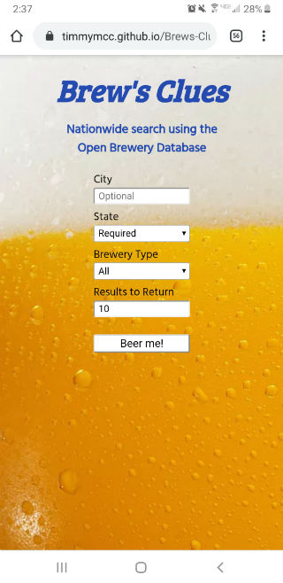
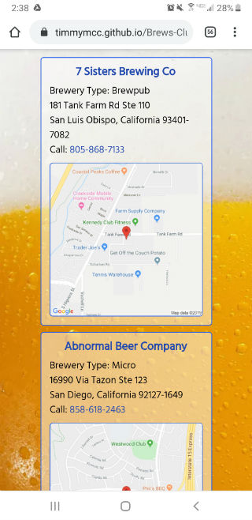

# BREW'S CLUES

Live app can be found [here](https://timmymcc.github.io/Brews-Clues-Brewery-Search/).

## Motivation

I love beer, and so do a lot of other people. Some of the best times I've had have been at breweries, both in my home town of Milwaukee and in various cities to which I have travelled. So I wanted to create an app that would allow the user to search for breweries all across the nation.

## Description

The user can conduct a search using one required and two optional criteria. They also choose how many results to return (1-50, with a default of 10). Each brewery's information (name, type, address, phone number and Google Map) displays in it's own box. Once the results are displayed, the user can click on the brewery's name to go directly to that brewery's website in a new browser window, on the phone number to call the brewery and/or on the map to open up a full Google Map either in the app or in a new browser window, depending on the device being used. After completing a search, the user has the option to clear the form but can do multiple searches in succession without clearing it.

## Screenshots

### Mobile

### Desktop

## Technologies Used

+ HTML
+ CSS
+ JavaScript
+ jQuery

## Notes

I originally wanted to include what the database called "tag lists" (dog-friendly, patio, food, tours, etc.) as one of the optional search criteria, but an overwhelming majority of the tag lists were completely empty. It's worth noting that the database is still being updated, so perhaps in the future I will be able to re-examine my work and update the app to include this additional information.
